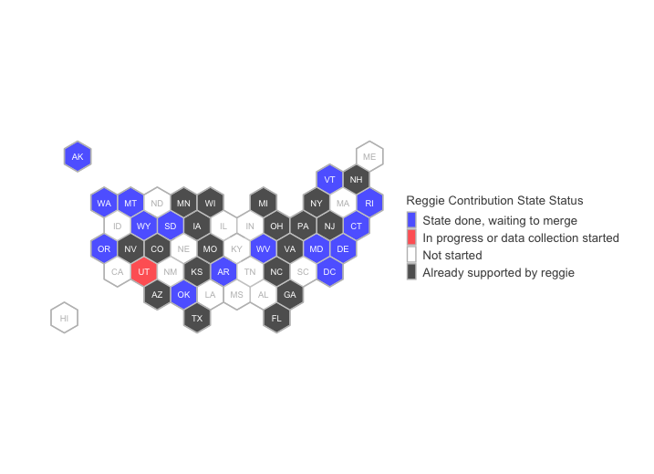

_Ongoing project_

<a href="https://github.com/Voteshield/reggie"> Reggie</a> is an open-source package run by VoteShield designed to help researchers clean U.S. voter file data. The package already supports 19 states, including New York, Florida, North Carolina, and Pennsylvania. During the summer of 2020, Dr. McDonald (<a href="https://twitter.com/electproject">@ElectProject</a>) organized myself and several other fellow students to contribute to the reggie package by adding state support using data he has collected. 

A map of our current progress can be seen below.

I use this folder for keeping independent helper scripts for my work.
